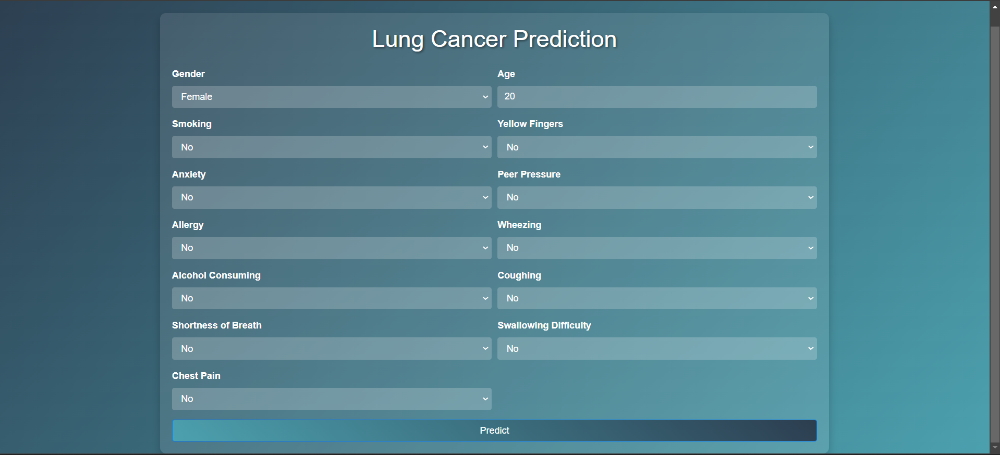

# 🌎 Lung Cancer Prediction Web Application

This web-based application predicts the likelihood of lung cancer based on user-provided health-related factors. Using **Machine Learning (Logistic Regression)**, the system analyzes input features to deliver predictions in a seamless and user-friendly manner.

---

## 🔥 Key Features
- ✅ **Accurate Predictions**: Uses a logistic regression model trained on survey data.
- 📊 **Model Accuracy**: Displays the model’s performance on test data.
- ⚙️ **Data Preprocessing**: Handles categorical data and applies label encoding for seamless processing.
- 🌐 **Responsive Design**: Easy-to-use web interface built with Flask and Bootstrap.

---

## 🛠️ Technologies Used
- **Flask**: Backend framework for handling requests and responses.
- **pandas**: Data manipulation and preprocessing.
- **scikit-learn**: Logistic regression and data splitting utilities.
- **HTML/CSS**: For creating an interactive and responsive UI.

---

## 🎮 Preview of Output



---

## 📚 Installation Guide

### 1. Clone the Repository
```bash
$ git clone https://github.com/kishore8220/Lung_Cancer_Prediction.git
$ cd lungcancer
```

### 2. Set Up the Virtual Environment (Optional but Recommended)
```bash
$ python -m venv venv
```

### 3. Activate the Environment
- **Windows**:
  ```bash
  venv\Scripts\activate
  ```
- **Mac/Linux**:
  ```bash
  source venv/bin/activate
  ```

### 4. Install Dependencies
```bash
$ pip install -r requirements.txt
```

### 5. Add Dataset
Download the dataset `lung_cancer_survey.csv` and place it in the project’s root directory.

### 6. Start the Application
```bash
$ python app.py
```

### 7. Access the Application
Open your browser and navigate to:
```
http://127.0.0.1:5000/
```

---

## 🏡 Application Pages Overview

### **Home Page**
- Input form for user health-related data.
- Fields include:
  - **Gender**, **Age**, **Smoking Status**, **Symptoms** (e.g., Coughing, Chest Pain), and more.

### **Prediction Page**
- Displays whether the person is predicted to have **Lung Cancer** or **Not Cancer**.
- Shows the logistic regression model’s accuracy.

---

## ⚖️ Code Highlights

### **Model Workflow**:
1. **Data Loading & Preprocessing**:
   - Loads `lung_cancer_survey.csv` using `pandas`.
   - Handles categorical features with `LabelEncoder`.

2. **Training**:
   - Splits the data into training and test sets using `train_test_split`.
   - Fits the logistic regression model to the training data.

3. **Prediction**:
   - Processes user inputs via the web form.
   - Makes predictions using the trained model.

### Flask Routes
- **`/`** (Home): Displays the input form.
- **`/predict`**: Processes inputs and returns prediction results.

---

## 🔄 Project Structure

```
project/
├── app.py                 # Main application file
├── lung_cancer_survey.csv # Dataset
├── templates/             # HTML templates
│   ├── index.html         # Input form
│   └── result.html        # Results page
├── static/                # Static files (CSS, JS, images)
└── requirements.txt       # Dependencies
```

---

## 🔄 Dataset Overview
- **File**: `lung_cancer_survey.csv`
- **Attributes**:
  - **Input Features**: Age, Gender, Smoking Status, Symptoms, etc.
  - **Target Variable**: `LUNG_CANCER` (1: Cancer, 0: Not Cancer)

---

## 🔍 Sample Output

- **Input**: Gender: Male, Age: 45, Smoking: Yes, Chest Pain: Yes
- **Output**: Prediction: **Cancer**
  - Model Accuracy: **85%**

---

## 🔧 Contributing
1. Fork the repository.
2. Make your changes.
3. Create a pull request for review.

---

## 🛠 License
This project is licensed under the MIT License. See the [LICENSE](LICENSE) file for details.

---

## 📢 Contact
Have questions or feedback? Reach out at:
- **Email**: [kdkishore91@gmail.com](mailto:kdkishore91@gmail.com)

